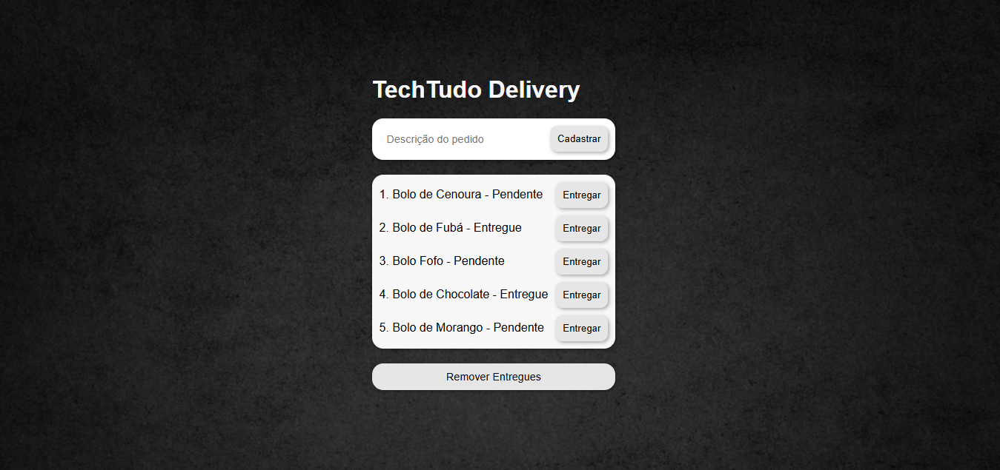

# 🛵 TechTudo Delivery

[](https://opensource.org/licenses/MIT)


Sistema de gerenciamento de pedidos com frontend em **React + TypeScript** e backend em **Node.js + Express + TypeScript**, organizado em arquitetura MVC. Ideal para praticar conceitos de desenvolvimento fullstack.

## Pré-visualização
Confira uma prévia:



## 📦 Funcionalidades

✅ **Cadastrar Pedido**  
✅ **Listar Pedidos**  
✅ **Marcar Pedido como Entregue**  
✅ **Remover Pedidos Entregues**  
✅ **Interface simples com React**  
✅ **API REST com Express + MVC**

## 🛠️ Tecnologias Utilizadas

### ⚙️ Backend
- Node.js v18+
- TypeScript 4.9+
- Express 4.18+
- Nodemon 3.0+
- Arquitetura MVC

### 💻 Frontend
- React 18+
- Vite 4.4+
- TypeScript 5.0+
- Axios 1.4+
- HTML5 e CSS3

## 🗂️ Estrutura de Pastas

```
TechTudoDelivery/
├── backend/
│   ├── controller/
│   │   └── PedidoController.ts
│   ├── model/
│   │   └── PedidoModel.ts
│   ├── view/
│   │   └── PedidoView.ts
|   ├── index.ts
│   ├── server.ts
│   └── tsconfig.json
├── frontend/
│   ├── src/
|   |   ├── services/
|   |   |   └── api.tsx
│   │   ├── App.tsx
│   │   └── main.tsx
│   ├── index.html
│   ├── vite.config.ts
│   └── package.json
```

## 🚀 Como Executar o Projeto

### Pré-requisitos
- Node.js v18+
- npm v9+
- TypeScript v4.9+

### 🛠 Backend

1. Acesse a pasta do backend:
```bash
cd backend
```

2. Instale as dependências:
```bash
npm install
```

3. Inicie o servidor:
```bash
npm run dev
```
> Servidor rodando em: http://localhost:5000

### 💻 Frontend

1. Acesse a pasta do frontend:
```bash
cd frontend
```

2. Instale as dependências:
```bash
npm install
```

3. Inicie a aplicação:
```bash
npm run dev
```
> Aplicação disponível em: http://localhost:5173

## 🔗 Endpoints da API

| Método | Endpoint                  | Descrição                         |
|--------|---------------------------|-----------------------------------|
| GET    | `/pedidos`                | Lista todos os pedidos            |
| POST   | `/pedidos`                | Cadastra um novo pedido           |
| PATCH  | `/pedidos/:id/entregar`   | Marca pedido como entregue        |
| DELETE | `/pedidos/entregues`      | Remove pedidos entregues          |

## 📄 Licença

Este projeto está sob a licença MIT. Consulte o arquivo [LICENSE](LICENSE) para detalhes.

---

```bash
# Clonar repositório
git clone https://github.com/fel1pee3/TechTudoDelivery-fullstack.git
cd techtudo-delivery
```
